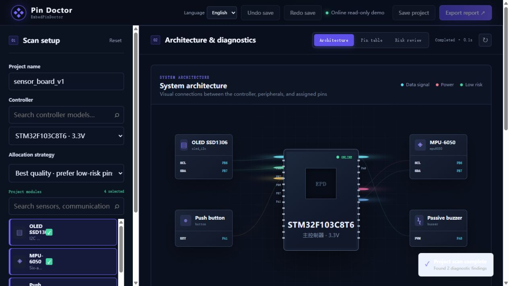
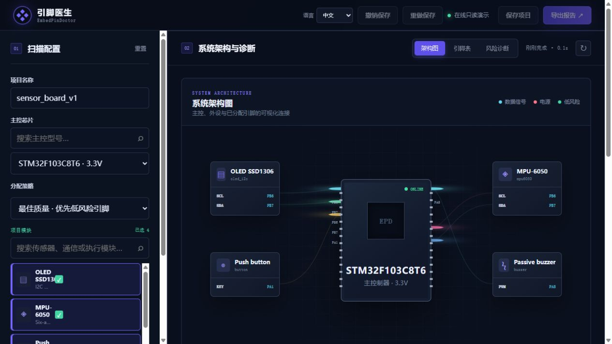

# EmbedPinDoctor

[简体中文](README.md) | [English](README_EN.md)

[](VERSION)
[](https://www.python.org/)
[](LICENSE)
[](https://github.com/actrox/EmbedPinDoctor/actions/workflows/ci.yml)
[](https://actrox.github.io/EmbedPinDoctor/)

EmbedPinDoctor is a local-first embedded hardware design assistant. Select a controller and project modules to plan pin assignments, detect electrical and bus-level risks, scan existing firmware and schematic projects, and receive actionable repair recommendations.

Version `0.2.0-alpha.1` covers the P0–P4 roadmap: trustworthy diagnostics, project scanning, recommendation and repair loops, release-grade project storage, and a safe local data/plugin ecosystem.

## Preview and online demo

[Try the read-only online demo](https://actrox.github.io/EmbedPinDoctor/). The demo uses bundled sample data and never reads or uploads local files. Project scanning, persistence, exports, and extension installation are available in the local application.



The interface can be switched between English and Simplified Chinese from the language selector in the top-right corner.



## Highlights

- Deterministic bounded-backtracking pin allocation with pin locking, minimum-change planning, and alternative plans.
- Electrical checks for voltage domains, input-only pins, drive current, 5 V tolerance, open-drain requirements, boot pins, and debug pins.
- Bus-level checks for I2C addresses, SPI modes and frequency limits, UART flow control, and PWM timer conflicts.
- Read-only scanning for PlatformIO, Arduino, ESP-IDF, STM32CubeMX, and KiCad projects, including source file and line references.
- Versioned JSON schemas, confidence-aware hardware data, package validation, and data auditing.
- Atomic project saves, schema migration, persistent undo/redo history, rotating logs, and privacy-safe diagnostics.
- Local data, rule, and declarative plugin packages with SemVer, optional SHA-256 verification, rollback, and uninstall.

## Quick start

Requires Python 3.11 or newer. The core local server has no mandatory third-party dependency.

```bash
git clone https://github.com/actrox/EmbedPinDoctor.git
cd EmbedPinDoctor
python start_embedpindoctor.py
```

The launcher selects an available local port and opens the workbench automatically.

### Command-line example

```bash
python app/cli.py \
  --chip stm32f103c8t6 \
  --modules oled_i2c mpu6050 button buzzer sd_card \
  --out output/demo_wiring.md
```

## Tests and code quality

The repository includes allocator/checker unit tests, real HTTP API integration tests, and web asset tests. GitHub Actions validates Python 3.11 and 3.12, audits hardware data, and runs ESLint and Prettier.

```bash
python -m unittest discover -s tests -p "test_*.py" -v
python -m quality.data_audit
npm ci
npm run lint
npm run format:check
```

## Optional FastAPI mode

```bash
pip install -r requirements.txt
python -m app.fastapi_app
```

Open `http://127.0.0.1:8765/docs` for the generated OpenAPI documentation.

## Supported outputs

- Markdown wiring and risk report
- `pins.h` C/C++ definitions
- Arduino initialization snippets
- STM32 HAL initialization snippets
- ESP-IDF configuration snippets
- KiCad labels and net hints
- PlatformIO project skeletons
- STM32CubeMX `.ioc` hints
- SVG pin diagrams with assignment and risk highlighting

## Windows build

```bat
pip install pyinstaller
build_windows.bat
```

The executable is generated at `dist\EmbedPinDoctor.exe`. Runtime data is stored under `%LOCALAPPDATA%\EmbedPinDoctor`.

## Safety notice

EmbedPinDoctor is currently alpha software and provides design assistance, not manufacturing approval. Always verify the final design against official datasheets, the schematic, power integrity requirements, and physical electrical tests before fabrication.

See [CHANGELOG.md](CHANGELOG.md) for release history.
